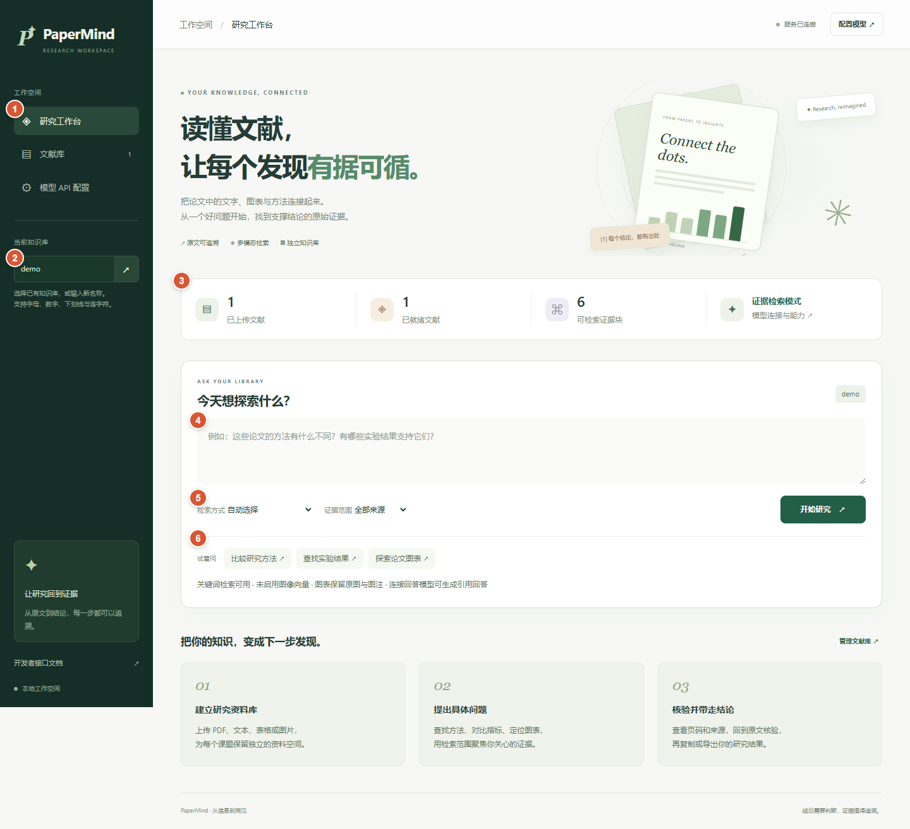
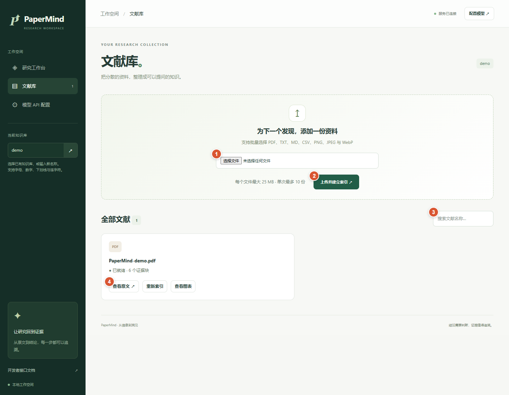
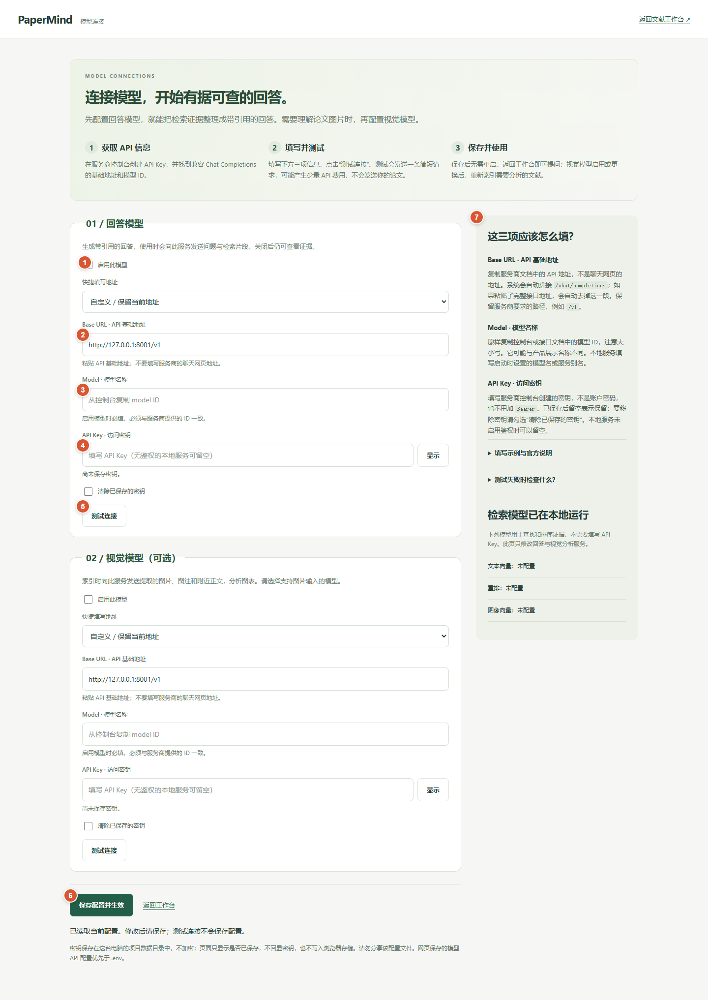
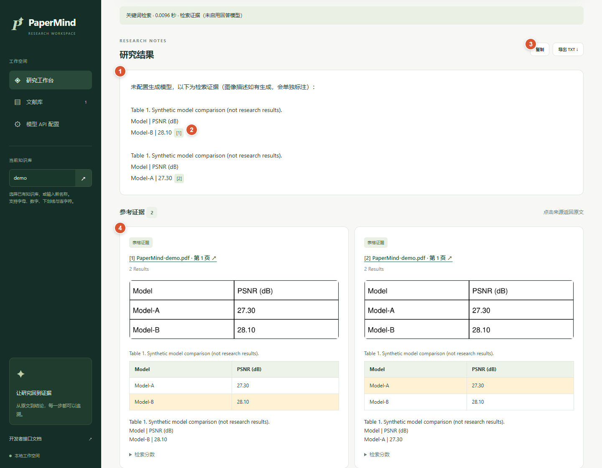

# PaperMind

**读懂文献，让每个发现有据可循。**

PaperMind 是一个可本地运行的多模态科研文献检索工作台。上传论文、文本、表格或图片后，可以检索方法与实验结果，查看原文页码、图片及表格；连接回答模型后，可以生成带引用的回答。

> 当前适合本地使用、项目展示与产品演示。账号、租户权限、订阅计费与公网部署体系尚未实现，不应直接作为多用户 SaaS 服务开放到公网。

[快速启动](#快速启动) · [工作台操作](#1-认识研究工作台) · [上传文献](#2-建立文献库) · [配置模型](#3-填写模型-api) · [查看结果](#4-检索核验与导出) · [常见问题](#常见问题)



## 已实现的能力

| 能力 | 说明 |
| --- | --- |
| 文献解析 | PDF、TXT、MD、CSV、PNG、JPEG、WebP；保留章节、页码和内容类型 |
| 文献库 | 独立集合、文件名搜索、批量上传、索引状态及重新索引 |
| 文本检索 | BM25、语义向量检索、RRF 融合与 CrossEncoder 重排 |
| 图片检索 | CLIP 文本到图片检索，与文本检索融合 |
| 图表来源 | 图片、图注、附近正文、原生 PDF 表格预览与长表格翻页 |
| 回答与视觉分析 | 可配置兼容 Chat Completions 的 LLM / VLM 服务 |
| 引用与导出 | 引用编号定位证据、原文页码跳转、复制、TXT 导出 |
| 工程接口 | FastAPI、命令行、SQLite 持久化、索引失败回滚、检索评测 |

## 快速启动

### 环境

- Python **3.11 或更高版本**，建议先用 Python 3.11 建立环境。
- 首次安装依赖和下载模型需要网络。CPU 可以运行已验证的小模型。
- 日常运行不需要 Node.js；只有前端 DOM 测试需要 Node.js / npm。

### Windows / PowerShell

在项目根目录执行。已有 `.venv` 时，可以跳过创建环境；已有 `.env` 时，下面的命令会保留它。

```powershell
python -m venv .venv
.\.venv\Scripts\python.exe -m pip install -e ".[api,pdf,vision,models,test]"
if (!(Test-Path .env)) { Copy-Item .env.example .env }
.\.venv\Scripts\python.exe -m papermind.cli serve --host 127.0.0.1 --port 8765
```

不需要激活虚拟环境，也不需要修改 PowerShell 执行策略。服务运行期间保留终端，按 `Ctrl+C` 停止。

### macOS / Linux

```bash
python3 -m venv .venv
./.venv/bin/python -m pip install -e ".[api,pdf,vision,models,test]"
test -f .env || cp .env.example .env
./.venv/bin/python -m papermind.cli serve --host 127.0.0.1 --port 8765
```

启动后访问：

- 工作台：<http://127.0.0.1:8765/>
- 模型 API 配置：<http://127.0.0.1:8765/settings>
- 交互式接口文档：<http://127.0.0.1:8765/docs>

如果不指定 `--port`，命令行默认端口是 **8000**。本文统一使用 **8765**。

### 不填 API Key，也能先体验

LLM / VLM 都是可选项。未配置时，系统返回检索证据并保留图片与图注，不会假装已经生成回答或理解图片。

默认 `.env.example` 配置了英文文本向量与重排小模型，首次索引会下载权重。若要先离线体验 BM25，将 `.env` 中以下字段全部留空，再启动服务：

```dotenv
PAPERMIND_EMBEDDING_MODEL=
PAPERMIND_RERANKER_MODEL=
PAPERMIND_IMAGE_EMBEDDING_MODEL=
```

下载 [演示 PDF](docs/examples/PaperMind-demo.pdf)，按下面流程上传，即可复现截图中的检索结果。

## 1. 认识研究工作台

上方首页截图中的橙色编号对应以下操作：

| 编号 | 位置 | 使用方式 |
| --- | --- | --- |
| **1** | 左侧导航 | 在研究工作台、文献库和模型 API 配置之间切换 |
| **2** | 当前知识库 | 选择已有集合，或输入新名称并点击箭头；例如 `demo`、`super_resolution` |
| **3** | 统计卡片 | 查看当前集合的文献数量、已就绪数量、证据块数量与模型配置状态 |
| **4** | 问题输入框 | 输入具体问题；推荐说明方法、指标、数据集等关键词 |
| **5** | 检索选项与开始研究 | 选择检索方式、证据范围，然后点击“开始研究” |
| **6** | 示例问题 | 点击后填入问题，可继续编辑；不会自动发起查询 |

知识库名称允许 1–64 位字母、数字、下划线或连字符。新名称在上传第一份文献后会出现在已有集合列表中。集合是资料分组，不是用户权限隔离机制。

输入问题后也可以使用 **Ctrl+Enter**（macOS：**Command+Enter**）提交。

## 2. 建立文献库



1. 点击左侧“文献库”，在 **① 文件选择框**选择资料。单次最多 10 份，每份不超过 25 MB，文件不能为空。
2. 点击 **② 上传并建立索引**。页面逐份显示处理结果，完成后文献显示“已就绪”及证据块数量。
3. 使用 **③ 搜索框**按文件名筛选当前集合中的文献。
4. 在 **④ 文献操作区**中选择“查看原文”“重新索引”或“查看图表”。上传成功但索引失败时，可以在这里重试索引。

首次加载模型可能较慢。切换了向量模型后，需要重新索引受影响集合；启用或更换视觉模型后，需要重新索引想要分析图表的文献。

“查看图表”会显示提取的图片、章节、页码、原文图注和结构化表格。长表格可通过上一页 / 下一页浏览。

## 3. 填写模型 API



先配置“回答模型”。需要分析图片时，再以同样方式填写下方的“视觉模型”。

| 编号 | 字段 / 按钮 | 怎么填或怎么操作 |
| --- | --- | --- |
| **1** | 启用此模型 | 勾选后，保存才会启用；取消勾选可停用服务 |
| **2** | Base URL | 填服务商提供的 API 基础地址，不是聊天网页地址；保留服务商要求的路径，例如 `/v1` |
| **3** | Model | 原样复制控制台或接口文档中的模型 ID，注意大小写；本地服务使用部署时设置的模型名称或别名 |
| **4** | API Key | 填控制台创建的密钥，不要加 `Bearer`，也不要填账户密码；无鉴权的本地服务可留空 |
| **5** | 测试连接 | 发送一条简短测试请求；视觉测试会附带一张测试图片，不会发送你的论文 |
| **6** | 保存配置并生效 | 点击后立即应用，无需重启；测试成功不会自动保存 |
| **7** | 填写帮助 | 查看字段说明、服务商示例及错误排查 |

例如，本地服务实际监听 8001 端口且使用 `/v1` 路径时，Base URL 可填 `http://127.0.0.1:8001/v1`。这只是填写示例，PaperMind 不会替你启动一个模型推理服务。

如果粘贴了以 `/chat/completions` 结尾的完整接口地址，保存时会自动去掉该后缀，再由请求端统一拼接。

**密钥的保留与清除：**

- 已保存后留空表示保留旧密钥，页面不回显它。
- 填入新密钥会替换旧密钥；勾选“清除已保存的密钥”会移除它。
- 更换 API 地址时，需要重新填写对应密钥或明确清除旧密钥，避免把旧密钥发给其他服务。
- 网页配置保存在数据目录的 `model-api.json` 中，优先于 `.env` 中的 LLM / VLM 配置。该文件不加密，不要提交或分享。

配置页只允许从本机访问。测试可能产生少量服务商费用；正式回答会向配置的服务发送问题及检索片段，视觉分析会发送提取的图片、图注和附近正文。

测试通过表示此次接口请求成功，不保证所有模型都能稳定返回项目要求的 JSON，也不代表图表识别结果一定准确。

## 4. 检索、核验与导出

上传演示 PDF 后，可以输入 **`Model-B PSNR`**，将证据范围设为“表格”，点击“开始研究”。



| 编号 | 操作 | 说明 |
| --- | --- | --- |
| **1** | 阅读研究结果 | 未配置回答模型时显示证据摘录；配置后可生成带引用的回答；证据不足时不应生成确定结论 |
| **2** | 点击引用编号 | 如 `[1]`，跳到本页对应的来源卡片 |
| **3** | 复制 / 导出 TXT | 带走当前问题、结果和引用来源；导出的原文链接仍指向本地服务 |
| **4** | 核验来源 | 查看文件名、页码、章节、摘录及图表；点击文件链接打开原文，表格中会高亮命中行 |

截图中的 Model-A / Model-B 与 PSNR 数值来自**合成演示数据**，不是科研论文结论或项目准确率指标。截图中的橙色编号仅用于文档说明，不出现在正常产品页面中。

## 检索方式怎么选

| 方式 | 适合什么问题 | 所需配置 |
| --- | --- | --- |
| 自动选择 | 不确定时优先使用，按已建立的索引选择链路 | 随当前配置变化 |
| 关键词 / BM25 | 明确的方法名、指标、数据集或术语 | 不需要模型 API |
| 语义检索 / Dense | 同义表述、自然语言查找相关段落 | 文本向量模型与已有向量索引 |
| 融合检索 / RRF | 同时使用关键词与语义检索 | 文本向量模型 |
| 融合检索 + 重排 | 对候选证据进一步排序 | 文本向量模型与重排模型 |
| 图像向量检索 | 用文字找相关图片 | CLIP 模型与已建立的图片索引 |
| 多模态融合（可加重排） | 综合文本和图片证据 | 图片向量模型；加重排时需重排模型 |

来源范围可选择“全部来源”“正文”“表格”“图片”。置灰选项表示缺少相应模型配置；已配置模型但尚未建立索引时，也需要先索引文献。

本地检索模型在 `.env` 中设置，API 配置页仅管理回答与视觉分析服务：

```dotenv
PAPERMIND_EMBEDDING_MODEL=sentence-transformers/all-MiniLM-L6-v2
PAPERMIND_RERANKER_MODEL=cross-encoder/ms-marco-TinyBERT-L2-v2
PAPERMIND_IMAGE_EMBEDDING_MODEL=sentence-transformers/clip-ViT-B-32
```

这些已验证模型以英文场景为主，不能把英文演示效果直接当作中文文献检索质量。修改后重启服务，并重新索引相关文献。

## 常见问题

| 问题 | 处理方法 |
| --- | --- |
| 页面打不开 | 确认启动命令仍在运行，地址端口与 `--port` 一致；端口占用时改用其他端口 |
| 首次索引很慢 | 检查网络与终端模型下载日志；首次加载模型后，后续通常可使用缓存 |
| 只看到证据，没有自然语言回答 | 在模型 API 配置页启用回答模型，测试并保存 |
| 图片提示“未启用视觉分析” | 配置支持图片输入的视觉模型，并重新索引相关文献；CLIP 图片检索本身不生成视觉描述 |
| 401 / 403 | 检查密钥、服务权限和模型授权 |
| 404 | 核对 API 基础地址与模型 ID；不要填写服务商聊天网页地址 |
| 429 / 超时 | 检查服务商额度、网络和模型服务状态，再重试 |
| 保存成功，但回答报 JSON 错误 | 当前服务需要模型遵循结构化 JSON 输出；核对模型能力与接口兼容性，连接测试不能替代完整回答验证 |
| 提示向量配置变化 | 对当前集合重新索引，确保索引与当前向量模型匹配 |
| 查不到资料 | 检查当前知识库、文献是否已就绪、证据范围是否太窄，并尝试更具体的关键词 |
| PDF 没有可提取内容 | 当前未提供完整 OCR 流水线；复杂扫描件、版面、矢量图和表格可能无法准确解析 |
| 复制失败 | 使用“导出 TXT”，或检查浏览器的剪贴板权限 |

## 开发与验证

主要代码按职责组织：

```text
papermind/
  api/          FastAPI、模型配置接口与静态页面
  parser/       文档、图片、图注与表格解析
  chunking/     结构化分块
  embedding/    文本与图片向量
  retrieval/    BM25、FAISS 与 RRF 融合
  reranker/     CrossEncoder 重排
  multimodal/   视觉模型调用与来源组织
  llm/          兼容模型服务客户端
  evaluation/   检索评测
  service.py    上传、索引、查询编排
  storage.py    SQLite 与原文资源存储
tests/          Python 与 DOM 交互测试
benchmark/      合成数据验证脚本
docs/           本 README 使用的截图与演示 PDF
```

在项目根目录执行：

```powershell
# 常规测试；默认跳过需要下载真实模型的两个测试
.\.venv\Scripts\python.exe -m pytest -q
.\.venv\Scripts\ruff.exe check papermind tests benchmark

# 可选：真实文本模型、重排模型及 CLIP 验证
$env:PAPERMIND_RUN_MODEL_TESTS='1'
$env:PAPERMIND_RUN_IMAGE_MODEL_TESTS='1'
.\.venv\Scripts\python.exe -m pytest -q

# 前端 DOM 交互测试
npm.cmd ci --prefix tests
npm.cmd test --prefix tests
```

最近一次完整 Python 验证为 **82 项通过**；DOM 测试覆盖导航、统计、搜索、上传及失败恢复、表格翻页、检索、引用、转义、复制与集合切换。测试通过不代表真实论文集上的准确率或生产负载能力已达标。

本文截图由实际运行的页面在独立 Chrome 会话中截取，使用单独的 `demo` 知识库、合成 PDF 和无外部 API 的关键词检索。页面交互未发现 JavaScript 错误；截图没有包含真实密钥或私人文献。

数据默认保存在 `data/`；`.env`、数据目录与依赖缓存已被 Git 忽略。当前仓库未声明开源许可证，如需对外分发或商业集成，应先明确项目及模型权重的许可范围。
